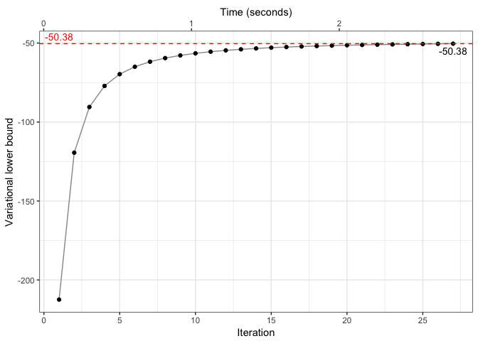

R/iprobit: Binary and multinomial probit regression using I-priors
================

[](https://travis-ci.org/haziqj/iprobit) [](https://ci.appveyor.com/project/haziqj/iprobit) [](https://codecov.io/gh/haziqj/iprobit)

This is an `R` package which extends I-prior regression to unordered categorical responses via a probit link function. This allows the user to fit models for classification or inference using fitted probabilities. Estimation is performed using a variational EM algorithm.

Binary classification (toy example)
-----------------------------------

#### Model fitting

``` r
dat <- gen_spiral(n = 300)  # generate binary toy example data set
mod <- iprobit(y ~ X1 + X2, dat, one.lam = TRUE, kernel = "FBM")
## ===============================================================
## Converged after 83 iterations.
```

#### Model summary

``` r
summary(mod)
## 
## Call:
## iprobit(formula = y ~ X1 + X2, data = dat)
## 
## Classes: 1, 2 
## 
## RKHS used:
## Fractional Brownian motion with Hurst coef. 0.5 (X1 + X2) 
## 
## Parameter estimates:
##          Mean   S.D.    2.5%  97.5%
## alpha  0.0000 0.0577 -0.1132 0.1132
## lambda 5.6717 0.2320  5.2170 6.1264
## 
## Converged to within 1e-05 tolerance. No. of iterations: 83
## Variational lower bound: -140.7109 
## Training error rate: 0.00 %. Brier score: 0.01
```

#### Boundary plot for two-dimensional covariates

``` r
iplot_predict(mod)
```


Multiclass classification (toy example)
---------------------------------------

#### Model fit report and parameter estimates

``` r
dat <- gen_mixture(n = 500, m = 4, sd = 1.5)  # generate 4-class toy example data set
(mod <- iprobit(y ~ X1 + X2, dat, control = list(maxit = 10)))
## ===========================================================================
## Convergence criterion not met.
## Training error rate: 11.40 %
## Lower bound value: -255.6279 
## 
##            Class = 1 Class = 2 Class = 3 Class = 4
## alpha        0.36808   0.40794   0.41848  -0.17639
## lambda[1,]   0.77036   0.00000   0.28644   0.00000
## lambda[2,]   0.55650   0.66290   0.00000   0.46823
```

#### Boundary plot for two-dimensional covariates

``` r
iplot_predict(mod)
```


#### Obtain out-of-sample test error rates, predicted classes and probabilities

``` r
dat.test <- gen_mixture(n = 100, m = 4, sd = 1.5)
(mod.pred <- predict(mod, newdata = dat.test))
## Test error rate: 11.000 %
## Brier score: 0.097 
## 
## Predicted classes:
##   [1] 1 1 2 1 1 4 1 2 1 1 2 2 2 1 1 1 1 1 1 1 1 1 2 1 1 2 1 1 1 1 2 2 2 2 2
##  [36] 2 2 2 2 2 2 2 2 2 2 2 2 2 2 2 2 2 2 2 2 2 2 2 2 2 2 3 2 3 3 3 3 3 3 3
##  [71] 3 3 3 3 3 3 3 3 3 3 3 3 3 3 3 4 4 4 4 4 4 4 4 4 4 4 1 4 4 3
## Levels: 1 2 3 4
## 
## Predicted probabilities:
##        1     2     3     4
## 1  0.822 0.117 0.004 0.058
## 2  0.843 0.035 0.001 0.121
## 3  0.476 0.516 0.006 0.001
## 4  0.585 0.375 0.023 0.017
## 5  0.726 0.211 0.014 0.048
## 6  0.293 0.000 0.000 0.707
## 7  0.620 0.360 0.010 0.009
## 8  0.436 0.564 0.000 0.000
## 9  0.723 0.206 0.016 0.055
## 10 0.823 0.099 0.004 0.074
## # ... with 90 more rows
```

Fisher's Iris data set
----------------------

#### Model fitting (common RKHS scale across classes for each covariate)

``` r
mod <- iprobit(Species ~ ., iris, kernel = "FBM", one.lam = TRUE,
               control = list(alpha0 = 1, lambda0 = 1, 
                              stop.crit = 1e-1,
                              common.RKHS.scale = TRUE, 
                              common.intercept = FALSE))
## ====================
## Converged after 27 iterations.

summary(mod)
## 
## Call:
## iprobit(formula = Species ~ ., data = iris)
## 
## Classes: setosa, versicolor, virginica 
## 
## RKHS used:
## Fractional Brownian motion with Hurst coef. 0.5 (Sepal.Length + ... + Petal.Width) 
## 
## Parameter estimates:
##            Mean   S.D.   2.5%  97.5%
## alpha[1] 0.8835 0.0816 0.7234 1.0435
## alpha[2] 1.0572 0.0816 0.8971 1.2172
## alpha[3] 1.0594 0.0816 0.8994 1.2194
## lambda   0.3474 0.0116 0.3246 0.3703
## 
## Converged to within 0.1 tolerance. No. of iterations: 27
## Variational lower bound: -50.38115 
## Training error rate: 4.67 %. Brier score: 0.03
```

#### Monitor convergence

``` r
iplot_lb(mod)
```



#### Plot of fitted probabilities

``` r
iplot_fitted(mod)
```


------------------------------------------------------------------------

Copyright (C) 2017 [Haziq Jamil](http://haziqj.ml).
