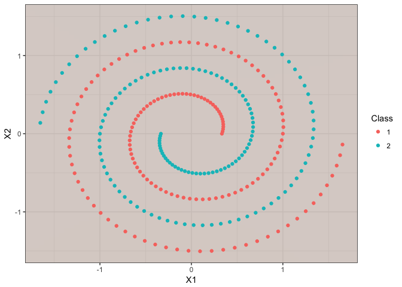
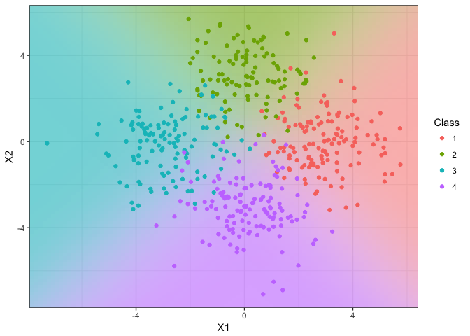
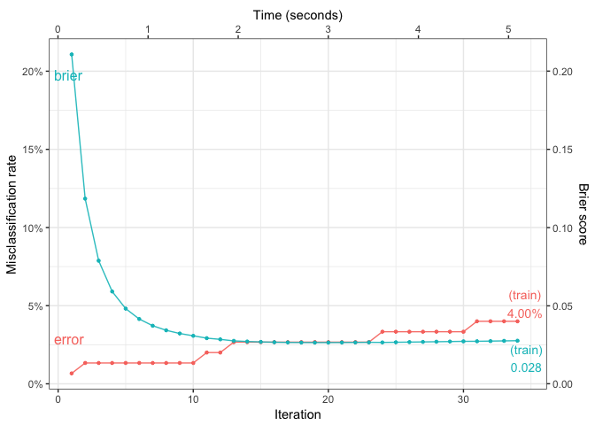
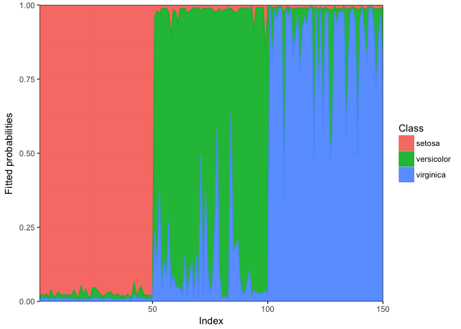

<!-- README.md is generated from README.Rmd. Please edit that file -->
R/iprobit: Binary and multinomial probit regression using I-priors
================

[](https://travis-ci.org/haziqj/iprobit)
[](https://ci.appveyor.com/project/haziqj/iprobit)
[](https://codecov.io/gh/haziqj/iprobit)

This is an `R` package which extends I-prior regression to unordered categorical responses via a probit link function. This allows the user to fit models for classification or inference using fitted probabilities. Estimation is performed using a variational EM algorithm. Visit <http://phd.haziqj.ml> for details.

Binary classification (toy example)
-----------------------------------

#### Model fitting

``` r
dat <- gen_spiral(n = 300)  # generate binary toy example data set
mod <- iprobit(y ~ X1 + X2, dat, one.lam = TRUE, kernel = "FBM")
## =========================================================================
## Converged after 97 iterations.
```

#### Model summary

``` r
summary(mod)
## 
## Call:
## iprobit(formula = y ~ X1 + X2, data = dat)
## 
## Classes: 1, 2 
## 
## RKHS used:
## Fractional Brownian motion with Hurst coef. 0.5 (X1 + X2) 
## 
## Parameter estimates:
##          Mean   S.D.    2.5%  97.5%
## alpha  0.0000 0.0577 -0.1132 0.1132
## lambda 5.6718 0.2320  5.2171 6.1266
## 
## Converged to within 1e-05 tolerance. No. of iterations: 97
## Variational lower bound: -140.7111 
## Training error rate: 0.00 %. Brier score: 0.01
```

#### Boundary plot for two-dimensional covariates

``` r
iplot_predict(mod)
```



Multiclass classification (toy example)
---------------------------------------

#### Model fit report and parameter estimates

``` r
dat <- gen_mixture(n = 500, m = 4, sd = 1.5)  # generate 4-class toy example data set
(mod <- iprobit(y ~ X1 + X2, dat, control = list(maxit = 10)))
## ===========================================================================
## Convergence criterion not met.
## Training error rate: 8.00 %
## Lower bound value: -254.5812 
## 
##            Class = 1 Class = 2 Class = 3 Class = 4
## alpha        0.69374   0.74913   0.66976   0.86683
## lambda[1,]   0.37127   0.00000   0.99950   0.00000
## lambda[2,]   0.00000   0.54280   0.00000   1.11792
```

#### Boundary plot for two-dimensional covariates

``` r
iplot_predict(mod)
## Warning in iprior::ggColPal(m): Deprecated. Use gg_colour_hue() instead.
```



#### Obtain out-of-sample test error rates, predicted classes and probabilities

``` r
dat.test <- gen_mixture(n = 100, m = 4, sd = 1.5)
(mod.pred <- predict(mod, newdata = dat.test))
## Test error : 7.000 %
## Brier score: 0.089 
## 
## Predicted classes:
##  [1] 1 1 1 1 2 1 1 1 1 4 ...
## Levels: 1 2 3 4 
## 
## Predicted probabilities:
##        1     2     3     4
## 1  0.784 0.110 0.004 0.102
## 2  0.729 0.175 0.008 0.088
## 3  0.857 0.049 0.001 0.093
## 4  0.697 0.074 0.009 0.221
## 5  0.340 0.474 0.106 0.081
## 6  0.618 0.298 0.019 0.066
## 7  0.741 0.234 0.003 0.023
## 8  0.818 0.176 0.000 0.006
## 9  0.902 0.072 0.000 0.026
## 10 0.293 0.051 0.078 0.577
## # ... with 90 more rows
```

Fisher's Iris data set
----------------------

#### Model fitting (common RKHS scale across classes for each covariate)

``` r
mod <- iprobit(Species ~ ., iris, kernel = "FBM", one.lam = TRUE,
               control = list(alpha0 = 1, lambda0 = 1, 
                              stop.crit = 1e-1,
                              common.RKHS.scale = TRUE, 
                              common.intercept = FALSE))
## ====================
## Converged after 27 iterations.

summary(mod)
## 
## Call:
## iprobit(formula = Species ~ ., data = iris)
## 
## Classes: setosa, versicolor, virginica 
## 
## RKHS used:
## Fractional Brownian motion with Hurst coef. 0.5 (Sepal.Length + ... + Petal.Width) 
## 
## Parameter estimates:
##            Mean   S.D.   2.5%  97.5%
## alpha[1] 0.8835 0.0816 0.7234 1.0435
## alpha[2] 1.0572 0.0816 0.8971 1.2172
## alpha[3] 1.0594 0.0816 0.8994 1.2194
## lambda   0.3474 0.0116 0.3246 0.3703
## 
## Converged to within 0.1 tolerance. No. of iterations: 27
## Variational lower bound: -50.38115 
## Training error rate: 4.67 %. Brier score: 0.03
```

#### Obtain training error rates, predicted classes and probabilities with posterior quantiles

``` r
fitted(mod, quantiles = TRUE)
##                       5%   25%   50%   75%   95%
## Training error (%) 2.000 3.333 4.000 4.667 5.333
## Brier score        0.026 0.028 0.031 0.033 0.036
## 
## Predicted probabilities for Class = setosa 
##      5%   25%   50%   75%   95%
## 1 0.972 0.979 0.986 0.990 0.994
## 2 0.954 0.967 0.977 0.984 0.989
## 3 0.966 0.979 0.984 0.989 0.993
## 4 0.947 0.966 0.976 0.981 0.988
## 5 0.972 0.980 0.986 0.991 0.995
## # ... with 145 more rows
## 
## Predicted probabilities for Class = versicolor 
##      5%   25%   50%   75%   95%
## 1 0.003 0.006 0.008 0.012 0.018
## 2 0.005 0.009 0.013 0.022 0.033
## 3 0.003 0.005 0.007 0.011 0.018
## 4 0.005 0.009 0.012 0.019 0.030
## 5 0.003 0.005 0.007 0.010 0.016
## # ... with 145 more rows
## 
## Predicted probabilities for Class = virginica 
##      5%   25%   50%   75%   95%
## 1 0.002 0.004 0.006 0.008 0.014
## 2 0.003 0.006 0.009 0.013 0.022
## 3 0.003 0.006 0.008 0.011 0.025
## 4 0.004 0.007 0.011 0.015 0.032
## 5 0.002 0.004 0.006 0.009 0.016
## # ... with 145 more rows
```

#### Monitor convergence

``` r
iplot_lb(mod)
```


#### Plot of training error over time

``` r
iplot_error(mod)
```



#### Plot of fitted probabilities

``` r
iplot_fitted(mod)
```



------------------------------------------------------------------------

Copyright (C) 2017 [Haziq Jamil](http://haziqj.ml).
