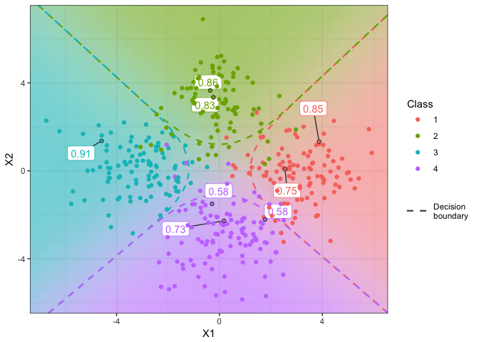

R/iprobit: Binary and multinomial probit regression using I-priors
================

<!-- README.md is generated from README.Rmd. Please edit that file -->
[](https://travis-ci.org/haziqj/iprobit) [](https://ci.appveyor.com/project/haziqj/iprobit) [](https://codecov.io/gh/haziqj/iprobit)

This is an `R` package which extends I-prior regression to unordered categorical responses via a probit link function. This allows the user to fit models for classification or inference using fitted probabilities. Estimation is performed using a variational EM algorithm. Visit <http://phd.haziqj.ml> for details.

Binary classification (toy example)
-----------------------------------

#### Model fitting

``` r
dat <- gen_spiral(n = 300, seed = 123)  # generate binary toy example data set
mod <- iprobit(y ~ X1 + X2, dat, one.lam = TRUE, kernel = "fbm")
## ==========================================
## Converged after 56 iterations.
```

#### Model summary

``` r
summary(mod)
## Call:
## iprobit(formula = y ~ X1 + X2, data = dat, kernel = "fbm", one.lam = TRUE)
## 
## Classes: 1, 2 
## 
## RKHS used:
## Fractional Brownian motion with Hurst 0.5 (X1 + X2)
## 
## Hyperparameters:
##             Mean   S.D.    2.5%  97.5%
## Intercept 0.0000 0.0577 -0.1132 0.1132
## lambda    5.6718 0.2320  5.2171 6.1265
## ---
## 
## Closed-form VB-EM algorithm. Iterations: 56/100 
## Converged to within 1e-05 tolerance. Time taken: 3.573205 secs
## Variational lower bound: -140.711 
## Training error: 0%. Brier score: 0.01466541
```

#### Boundary plot for two-dimensional covariates

``` r
iplot_predict(mod)
```


Multiclass classification (toy example)
---------------------------------------

#### Model fit report and parameter estimates

``` r
dat <- gen_mixture(n = 400, m = 4, sd = 1.5, seed = 123)  # generate 4-class 
                                                          # toy example data set
(mod <- iprobit(y ~ X1 + X2, dat, train.samp = sample(1:400, size = 392),
                control = list(maxit = 10)))  # set aside 8 points for testing
## ===========================================================================
## Convergence criterion not met.
## Training error rate: 6.89 %
## Lower bound value: -208.9813 
## 
##            Class = 1 Class = 2 Class = 3 Class = 4
## Intercept    0.32094   0.26087   0.30916   0.46155
## lambda[1,]  -0.21341   0.00000   0.62978   0.00000
## lambda[2,]   0.00000  -0.50221   0.00000  -2.66854
```

#### Boundary plot for two-dimensional covariates

``` r
iplot_predict(mod, dec.bound = TRUE, plot.test = TRUE, grid.len = 50)
```



#### Obtain out-of-sample test error rates, predicted classes and probabilities

``` r
predict(mod)
## Training error: 0.000%
## Brier score   : 0.071 
## 
## Predicted classes:
## [1] 1 1 2 2 3 4 4 4
## Levels: 1 2 3 4 
## 
## Predicted probabilities:
##       1     2     3     4
## 1 0.750 0.126 0.007 0.117
## 2 0.852 0.137 0.000 0.010
## 3 0.064 0.831 0.103 0.002
## 4 0.046 0.859 0.095 0.001
## 5 0.000 0.089 0.906 0.005
## 6 0.399 0.011 0.015 0.576
## 7 0.136 0.050 0.229 0.585
## 8 0.146 0.015 0.110 0.729
```

Fisher's Iris data set
----------------------

#### Model fitting (common RKHS scale across classes for each covariate)

``` r
mod <- iprobit(Species ~ ., iris, kernel = "fbm", one.lam = TRUE,
               common.RKHS.scale = TRUE, common.intercept = FALSE,
               control = list(alpha0 = 1, theta0 = 1, 
                              stop.crit = 1e-1))
## ==========================
## Converged after 34 iterations.

summary(mod)
## Call:
## iprobit(formula = Species ~ ., data = iris, kernel = "fbm", one.lam = TRUE, 
##     common.intercept = FALSE, common.RKHS.scale = TRUE, control = list(alpha0 = 1, 
##         theta0 = 1, stop.crit = 0.1))
## 
## Classes: setosa, versicolor, virginica 
## 
## RKHS used:
## Fractional Brownian motion with Hurst 0.5 (Sepal.Length + ... + Petal.Width)
## 
## Hyperparameters:
##                Mean   S.D.   2.5%  97.5%
## Intercept[1] 0.8813 0.0816 0.7213 1.0413
## Intercept[2] 1.0581 0.0816 0.8980 1.2181
## Intercept[3] 1.0606 0.0816 0.9006 1.2207
## lambda       0.3589 0.0120 0.3353 0.3824
## ---
## 
## Closed-form VB-EM algorithm. Iterations: 34/100 
## Converged to within 0.1 tolerance. Time taken: 5.10163 secs
## Variational lower bound: -50.39342 
## Training error: 4%. Brier score: 0.02759783
```

#### Obtain training error rates, predicted classes and probabilities with posterior quantiles

``` r
fitted(mod, quantiles = TRUE)
##                     2.5%   25%   50%   75% 97.5%
## Training error (%) 2.000 2.667 3.333 4.000 5.683
## Brier score        0.025 0.027 0.029 0.032 0.036
## 
## Predicted probabilities for Class = setosa 
##    2.5%   25%   50%   75% 97.5%
## 1 0.966 0.979 0.985 0.989 0.993
## 2 0.937 0.964 0.975 0.982 0.991
## 3 0.957 0.977 0.982 0.988 0.994
## 4 0.938 0.961 0.972 0.981 0.990
## 5 0.967 0.980 0.986 0.990 0.994
## # ... with 145 more rows
## 
## Predicted probabilities for Class = versicolor 
##    2.5%   25%   50%   75% 97.5%
## 1 0.003 0.006 0.008 0.012 0.022
## 2 0.004 0.010 0.014 0.022 0.042
## 3 0.002 0.004 0.008 0.012 0.021
## 4 0.004 0.009 0.014 0.022 0.033
## 5 0.002 0.005 0.007 0.011 0.021
## # ... with 145 more rows
## 
## Predicted probabilities for Class = virginica 
##    2.5%   25%   50%   75% 97.5%
## 1 0.002 0.004 0.006 0.009 0.014
## 2 0.003 0.007 0.010 0.015 0.028
## 3 0.003 0.006 0.009 0.013 0.030
## 4 0.004 0.008 0.012 0.017 0.034
## 5 0.002 0.004 0.006 0.008 0.015
## # ... with 145 more rows
```

#### Monitor convergence

``` r
iplot_lb(mod)
```


#### Plot of training error over time

``` r
iplot_error(mod)
```


#### Plot of fitted probabilities

``` r
iplot_fitted(mod)
```


------------------------------------------------------------------------

Copyright (C) 2017 [Haziq Jamil](http://haziqj.ml).
